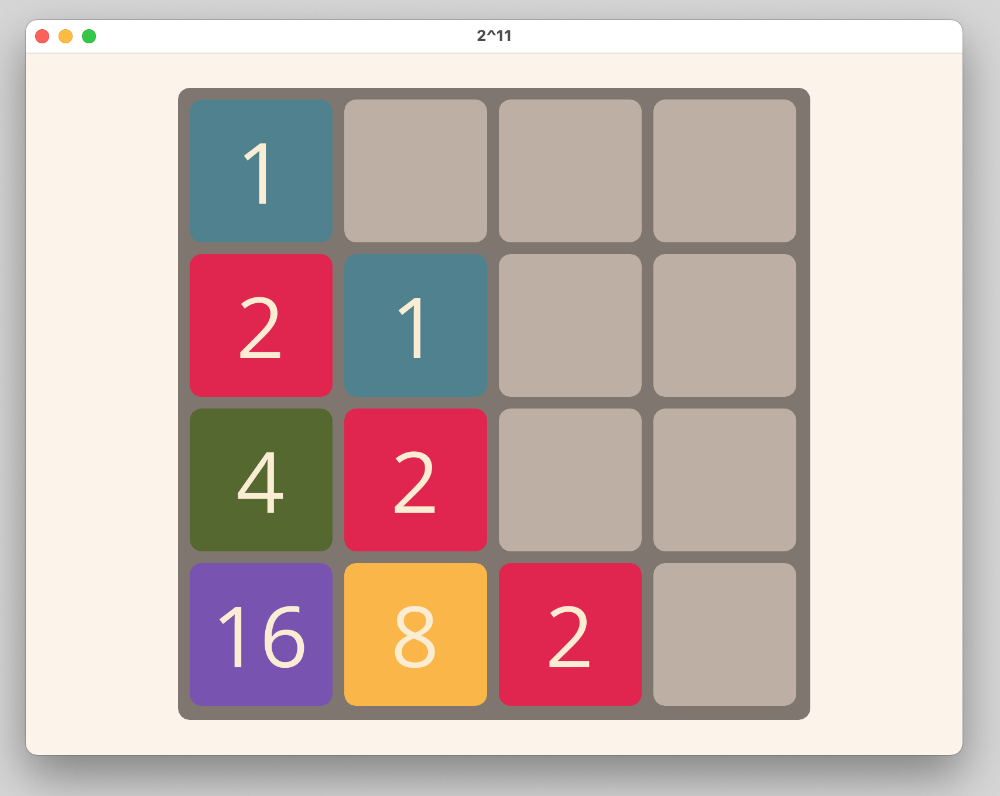
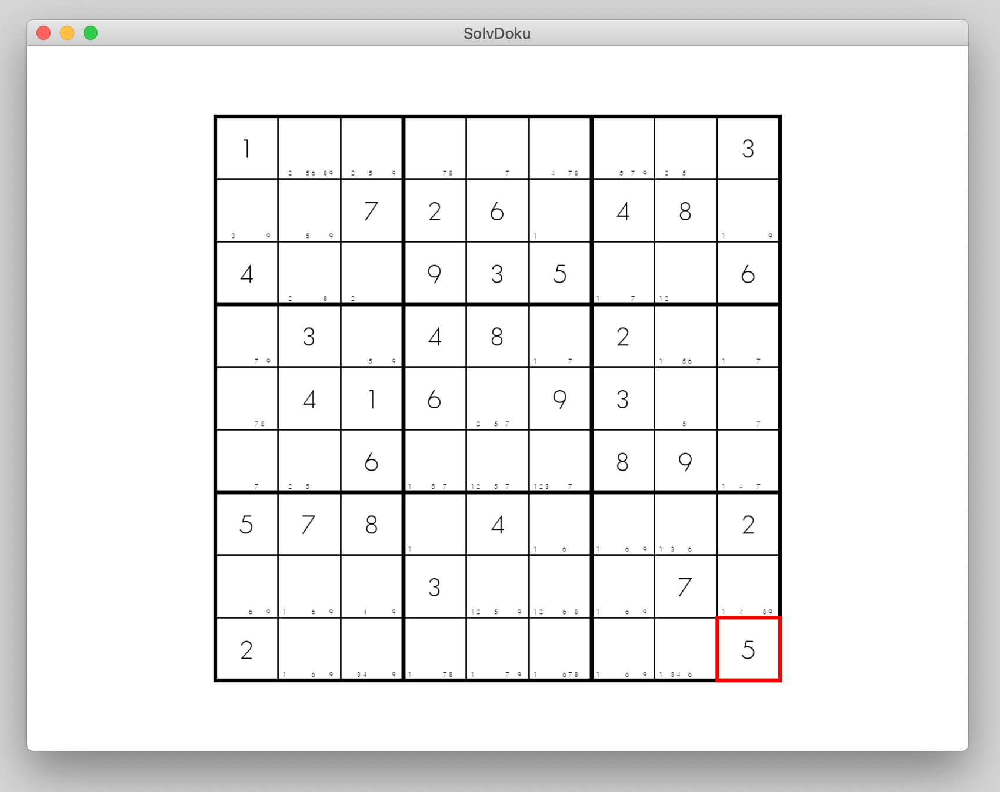

# LoveChunks
Just a place for my Löve tests/experiences

## 2^11
A kind of 2048 clone.

## clock
A simple analog clock.

## shifted
A 15 game clone

## solvdoku
The beginnings of a Sudoku game or Sudoku solving helper or Sudoku solver. Not sure yet.

## wclock
A german word clock.

